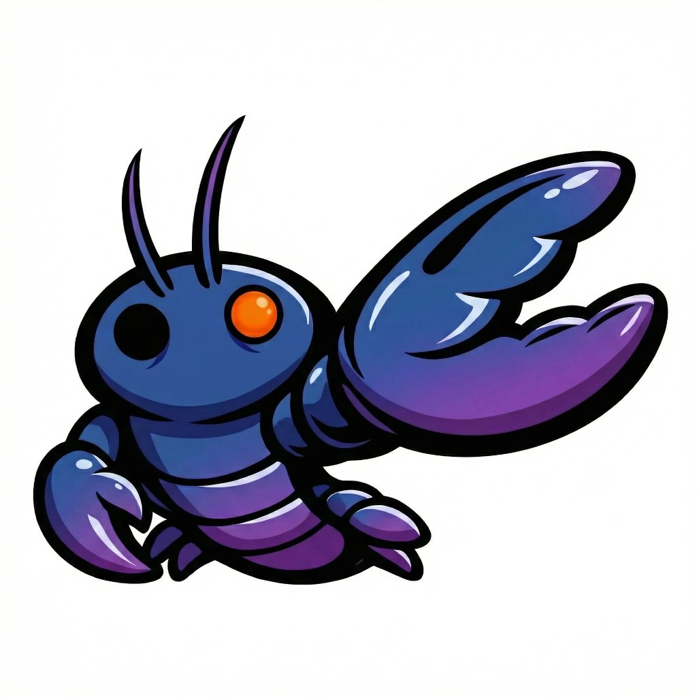

# Clawcolator

  

**Agent-first fork of [Percolator](https://github.com/aeyakovenko/percolator).**  
All market decisions are delegated to an autonomous OpenClaw agent, while the protocol strictly enforces financial invariants and system safety.

---

## What is Clawcolator?

Clawcolator is a **fork of Percolator** — a formally verified risk engine for perpetual DEXs on Solana — extended with an **agent-first** design:

- **OpenClaw agent** decides whether to accept, reject, or modify trade proposals.
- **Core engine** (from Percolator) enforces margin, liquidations, and balance-sheet safety.
- **Users propose** trades; the agent takes the other side. The protocol guarantees no net extraction beyond the balance sheet.

So: you propose a trade → the agent analyzes and decides → the core validates → position state updates. The agent is not “god” — the core has the final say on system invariants.

---

## Relation to Percolator

- **Percolator**: risk engine + accounting; pluggable matcher; no built-in “who decides.”
- **Clawcolator**: same engine, plus an **autonomous agent** (OpenClaw) as the primary decision-maker for market operations. The fork adds agent logic, UX, and tooling around the same verified core.

We keep the same security claim: **no user can withdraw more value than exists on the exchange balance sheet.**

---

## Repo contents

- **Rust**: `src/percolator.rs` (engine), `src/clawcolator.rs` (agent integration), `src/localhost.rs` (local testing).
- **Web**: `index.html`, `token.html`, `docs.html` — landing, token detail, and docs.
- **Formal verification**: Kani harnesses (see Percolator docs); run with `cargo kani`.

---

## Status

⚠️ **Educational / research.** Not production-ready. Do not use with real funds.

---

## Links

- **Site**: [Clawcolator](https://clawcolator.github.io) (or your deployment)
- **Upstream**: [Percolator](https://github.com/aeyakovenko/percolator)
